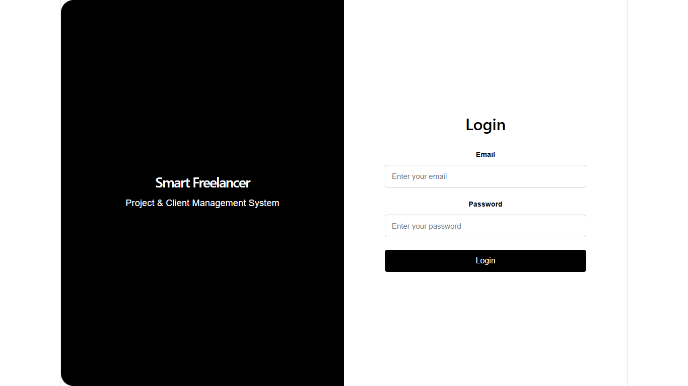
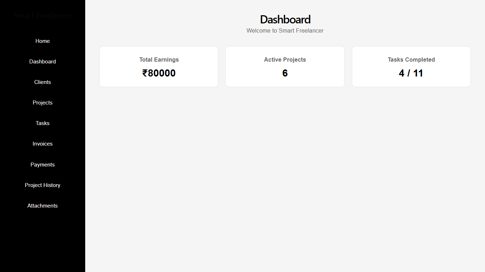
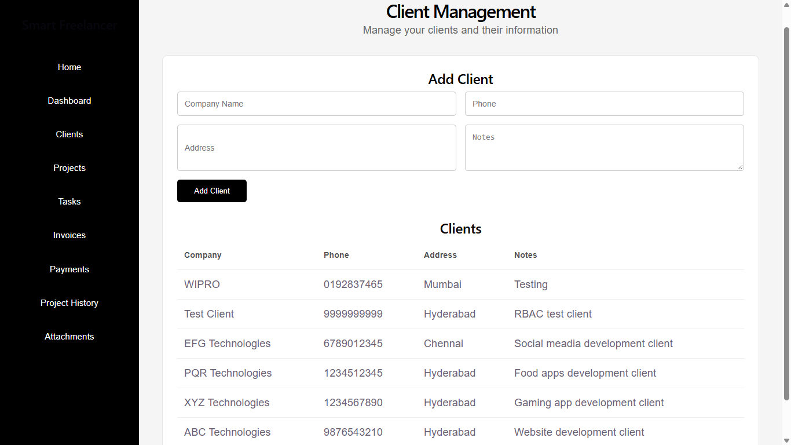
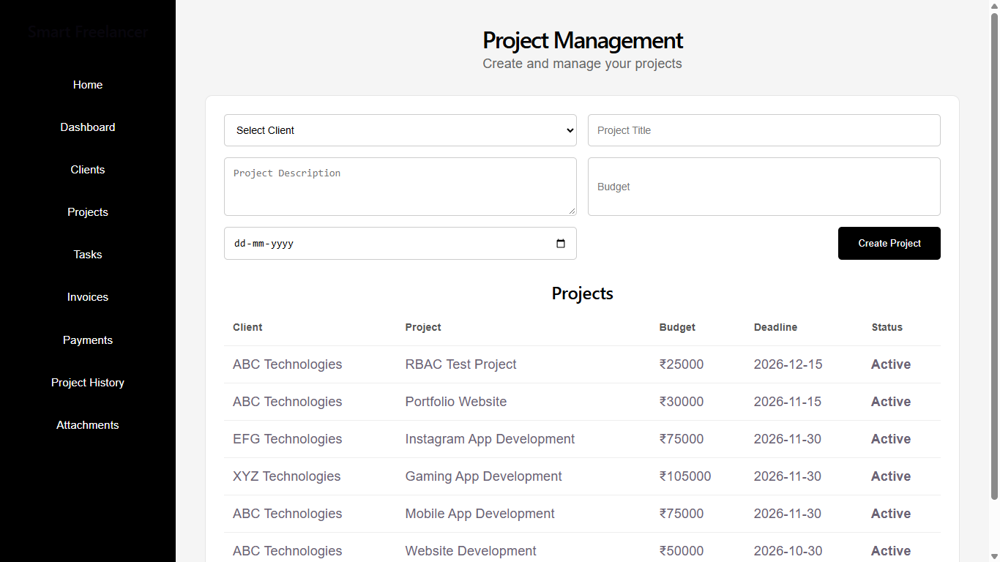
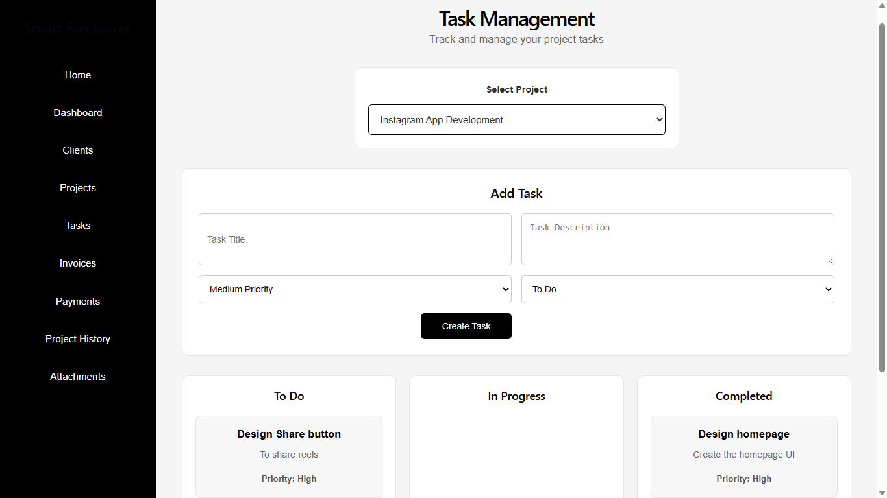
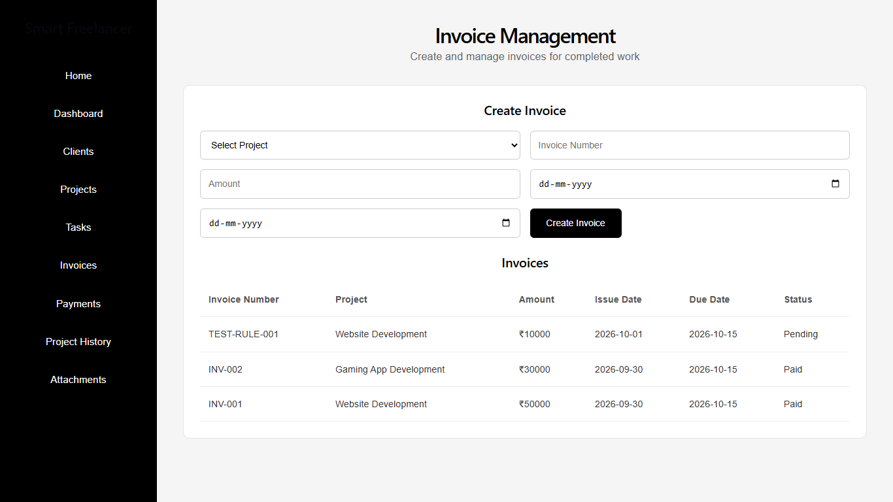
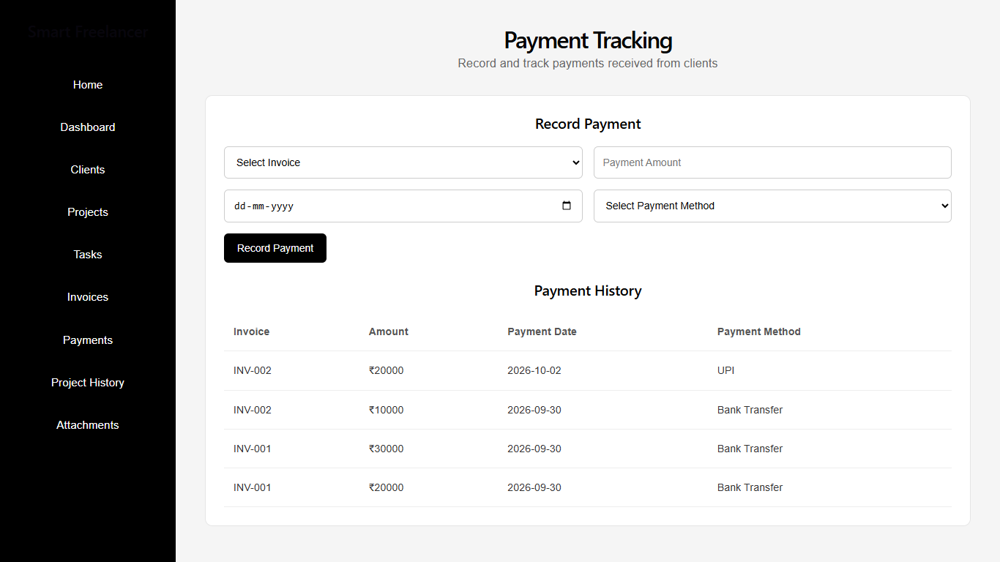
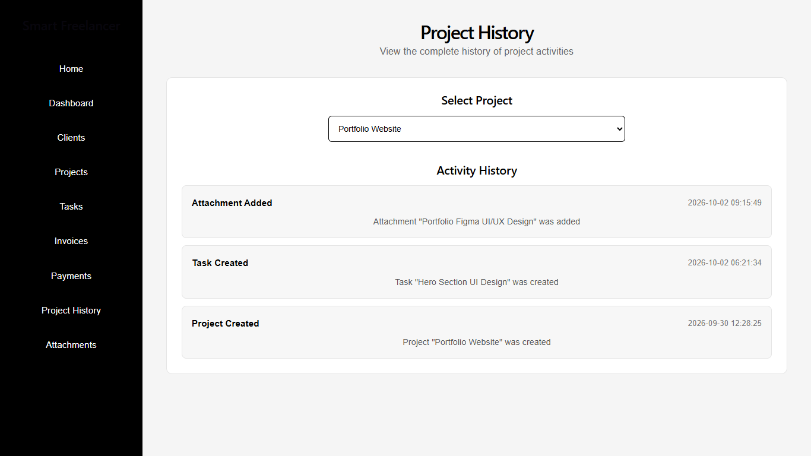
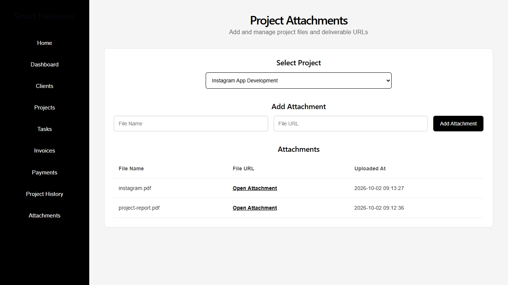

# Smart Freelancer Project & Client Management System

A full-stack web application that helps freelancers manage clients, projects, tasks, invoices, payments, project history, and project deliverables from a centralized system.

## Tech Stack

* **Frontend:** ReactJS, Vite, CSS
* **Backend:** Node.js, Express.js
* **Database:** SQLite
* **Authentication:** JWT
* **Database Driver:** better-sqlite3

## User Roles

The system supports three roles:

* **Freelancer** – Manage clients, projects, tasks, invoices, payments, attachments, and project history.
* **Client** – Supported through the role-based authentication architecture.
* **Admin** – Supported through the role-based authentication architecture.

## Features

### Client Management

* Create and manage client profiles
* View existing clients

### Project Management

* Create projects with budgets and deadlines
* Associate projects with clients
* Prevent duplicate projects for the same client with the same title
* View project progress

### Task Management

* Create tasks for projects
* Track task status
* Task lifecycle:

  * To Do
  * In Progress
  * Completed

### Dashboard

* View earnings
* View active projects
* View task progress

### Invoice Management

* Generate invoices for completed work
* Prevent duplicate invoice numbers
* Track invoice status

### Payment Tracking

* Record payments
* Validate payment amounts
* Automatically update invoice payment status:

  * Pending
  * Partially Paid
  * Paid

### Project History

* Record important project activities
* Track project lifecycle events

### Project Attachments

* Add project file names
* Add project deliverable URLs
* View project attachments
* Attachment additions are recorded in project history

### Authentication and Security

* JWT-based authentication
* Protected backend routes
* Role-based access control
* Environment-based JWT configuration

### Validation and Error Handling

* Frontend validation
* Backend validation
* Required field validation
* Duplicate project validation
* Duplicate invoice validation
* Payment balance validation
* Task status validation
* API error handling
* Empty states

## Project Structure

```text
smart-freelancer/
│
├── backend/
│   ├── src/
│   │   ├── database/
│   │   │   ├── db.js
│   │   │   └── init.js
│   │   │
│   │   ├── middleware/
│   │   │   └── authMiddleware.js
│   │   │
│   │   ├── routes/
│   │   │   ├── authRoutes.js
│   │   │   ├── clientRoutes.js
│   │   │   ├── projectRoutes.js
│   │   │   ├── taskRoutes.js
│   │   │   ├── invoiceRoutes.js
│   │   │   ├── paymentRoutes.js
│   │   │   ├── dashboardRoutes.js
│   │   │   ├── historyRoutes.js
│   │   │   └── attachmentRoutes.js
│   │   │
│   │   └── server.js
│   │
│   └── package.json
│
├── frontend/
│   ├── src/
│   │   ├── components/
│   │   │   └── Sidebar.jsx
│   │   │
│   │   ├── pages/
│   │   │   ├── Login.jsx
│   │   │   ├── Dashboard.jsx
│   │   │   ├── Clients.jsx
│   │   │   ├── Projects.jsx
│   │   │   ├── Tasks.jsx
│   │   │   ├── Invoices.jsx
│   │   │   ├── Payments.jsx
│   │   │   ├── ProjectHistory.jsx
│   │   │   └── ProjectAttachments.jsx
│   │   │
│   │   ├── api.js
│   │   └── App.jsx
│   │
│   └── package.json
│
├── docs/
│   └── screenshots/
│
├── .gitignore
└── README.md
```

## Prerequisites

Install the following:

* Node.js
* npm
* Git

## Backend Setup

Open a terminal in the project folder and run:

```bash
cd backend
npm install
```

Create a `.env` file inside the `backend` folder:

```env
PORT=5000
JWT_SECRET=your_secure_jwt_secret
```

Initialize the SQLite database:

```bash
node src/database/init.js
```

Start the backend server:

```bash
node src/server.js
```

The backend will run at:

```text
http://localhost:5000
```

API health check:

```text
http://localhost:5000/
```

## Frontend Setup

Open another terminal:

```bash
cd frontend
npm install
```

Start the React development server:

```bash
npm run dev
```

The frontend will normally run at:

```text
http://localhost:5173
```

## Production Build

To create the production frontend build:

```bash
cd frontend
npm run build
```

The generated production files are placed inside the `frontend/dist` directory.

## Environment Variables

The backend uses the following environment variables:

```env
PORT=5000
JWT_SECRET=your_secure_jwt_secret
```

### JWT_SECRET

`JWT_SECRET` is used to sign and verify JWT authentication tokens.

The `.env` file should not be committed to GitHub.

## Database

The application uses **SQLite** as the single source of truth for application data.

The database initialization file is:

```text
backend/src/database/init.js
```

Run the database initialization command from the backend directory:

```bash
node src/database/init.js
```

The database contains tables for:

* Users
* Clients
* Projects
* Tasks
* Invoices
* Payments
* Project History
* Project Attachments

SQLite database files are excluded from Git using `.gitignore`.

## API Endpoints

### Authentication

```text
POST /api/auth/register
POST /api/auth/login
```

### Clients

```text
POST /api/clients
GET  /api/clients
```

### Projects

```text
POST /api/projects
GET  /api/projects
```

### Tasks

```text
POST /api/tasks
GET  /api/tasks/project/:projectId
PUT  /api/tasks/:id/status
```

### Invoices

```text
POST /api/invoices
GET  /api/invoices
```

### Payments

```text
POST /api/payments
GET  /api/payments
```

### Dashboard

```text
GET /api/dashboard/summary
```

### Project History

```text
GET /api/history/project/:projectId
```

### Project Attachments

```text
POST /api/attachments
GET  /api/attachments/project/:projectId
```

## Business Rules

### Duplicate Projects

The system prevents creating two projects with the same title for the same client.

This is enforced using a database-level unique constraint.

### Task Status Lifecycle

```text
To Do → In Progress → Completed
```

### Invoice Rules

Invoices are generated for completed project work.

Duplicate invoice numbers are prevented.

### Payment Rules

Payment status is automatically maintained according to the amount paid:

```text
Pending → Partially Paid → Paid
```

Payments cannot exceed the remaining invoice balance.

### Role-Based Access Control

Protected APIs require a valid JWT token and the required user role.

Unauthorized and insufficiently authorized requests are rejected by the backend.

## Validation and Error Handling

The application includes:

* Frontend form validation
* Backend request validation
* Required field validation
* Client existence validation
* Project existence validation
* Duplicate project validation
* Duplicate invoice validation
* Task status validation
* Positive amount validation
* Payment balance validation
* Authentication validation
* Role authorization
* API error handling
* Empty states

## Screenshots

### Login



### Dashboard



### Client Management



### Projects



### Task Board



### Invoice Management



### Payment Tracking



### Project History



### Project Attachments



## Demo Credentials


```text
Email: gayathri.freelancer@gmail.com
Password: Test@12345
Role: Freelancer
```

## Deployment

The frontend communicates with the deployed backend API.

## Video Demonstration

The video will demonstrate:

1. Login and authentication
2. Client management
3. Project creation
4. Duplicate project validation
5. Task creation
6. Task status lifecycle
7. Dashboard
8. Invoice generation
9. Payment tracking
10. Project history
11. Project attachments
12. Backend/API usage
13. SQLite data persistence
14. Validation and error handling
15. Deployed application

## Code Quality

The project follows a modular full-stack architecture:

* React components and pages are separated from API logic.
* Express routes are organized by feature.
* Authentication and authorization are handled through middleware.
* SQLite is used as the application database.
* Important application data is fetched through backend APIs rather than hardcoded in the UI.
* Environment variables are used for sensitive configuration.
* Error handling and validation are implemented on the backend and frontend.

## Security

* JWT authentication is used for protected APIs.
* JWT secrets are stored in environment variables.
* `.env` files are excluded from version control.
* Database files are excluded from version control.
* Role-based authorization is enforced by backend middleware.

## Future Enhancements

Possible future enhancements include:

* AI-based task prioritization
* Automated invoice reminders
* Time tracking per task
* Advanced reporting and analytics

## License

This project was developed as an academic project.
